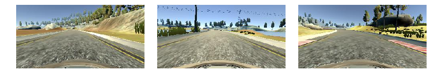
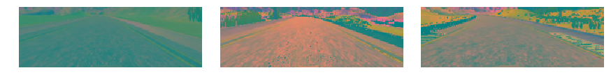
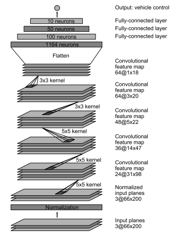

# Behaviorial Cloning Project

Overview
---

In this project, deep neural networks and convolutional neural networks are developed in Keras to learn driving behavior using front camera images. The model will output a steering angle to an autonomous vehicle.

Udacity has provided a simulator where you can steer a car around a track for data collection. I have used image data and steering angles to train a neural network and then use this model to drive the car autonomously around the track.

Please finf the Ipython notebook file for this project [here](https://github.com/ahmadesh/Udacity-CarND-Term1-Behavioral-Cloning/blob/master/Final.ipynb).

Files description
---
The submission includes five files: 
* Final.ipynb (script used to create and train the model to predict steering angles)
* drive.py (script to drive the car in Udacity simulator using the trained model)
* model.h5 (the trained Keras model)
* writeup.md (report file)
* Movie.mp4 (a video recording of your vehicle driving autonomously around the track for at least one full lap)

Solution
---
I started with the LeNet architecture to train the model, but soon converted to the Nvidia's architecture which is the state of the art network for this purpose, [End to End Learning for Self-Driving Cars](http://images.nvidia.com/content/tegra/automotive/images/2016/solutions/pdf/end-to-end-dl-using-px.pdf). The model is proved to be effective in the previous works. They start with importing a YUV image and normalizing the image. Then the model follows three CNN layers to extract the features from the input image. Then the output is flattened and fed into four fully connected layers and output a signle value which is the steering angle. I also added Dropout layers after the fully connected layers to avoid overfitting.

In the following, the methods I used to train this nwetwork using the simulator images are explained.

Data collection
---

The Udacity simulator provides a training section that captures and outputs the images from three cameras at the center, left and right side of the car and the streeing angle. I started with caputuring my own training data, however because I used keyboard to drive the car in the tracks, the training data is not smooth. 

Udacity's driving simulator provides two different test tracks, and all sample data was collected from track 1. The training data includes images from left, center and right and cameras on the front panel of the car (A sample of these traning images are shown bellow). 

Data Augmentation and Preprocessing
---
In the training data, there is only one steering angle provided for these left/center/right images. As the first method to augment the training data, the left and right images are also used with an offset (I chose 0.25) added and substracted from the steering angle. As the second augmentation method, for each training image, I filped it around the y axis and used the negative of the steering angle to the model. 

The input to the model as stated in the paper, should be a 66x200 pixels image with YUV layers. The original images from training have 160x320 size in RGB. Therefore, I crop the top 40 pixels and bottom 20 pixels of the input image which gives 100x320 pizels. I then resize the image to the desired 66x200 pixels. I also added a function that randomly changes the brightness of the images. Useing this function allows generalizing the model for different lighting conditions. I eventually convert the image to YUV layers using a CV2 function. This processed image is fed to the netwerk for training. Samples of the original images and the processed versions are shown here.

Original images:

Processed images:

### Network architecture

The Nvidia architecter model, as shown in the image, consist of 9 layers including a normalization layer, 5 convolution layers, and 3 fully connected layers. The image is fed with size 66x200x3 and the in the normalization layer the data are mapped into -1.0 to 1.0 range. The first convolution layer has 5x5 kernel and outputs 24@31x98. The second and third convolution layers have 5x5 kernel resulting in 36@14x47 and 48@5x22 respectively. The forth and fifth convolution layer have 3x3 kernel that output 64@3x20 and 64@1x18 respectively. Then the outputs are flatten resulting in 1164 nodes that are fed into three fully connected layers with 100, 50, 10 nodes and output into 1 node which is the steering angle. I also used dropout layers between the fully connected layers to avoid overfitting. The weights of the model are trained by minimizing the mean squared error between the output and the training steering angle using 'Adam' optimizer. The details of the model are shown in the following image.

## Training   
I used a batch generator function to provide the batches to the fitting function. For each batch, the function takes 32 sample lines that contains left, center, and right images. For the left and right images the steering angle was corrected by a constant (0.25). Also in order to augment the data and also balance the steering angle values in the data, each image was flipped and steering angle was multiplied by -1. Therefore, each line of the data is augmented to 6 samples. Also, in order to avoid bias toward 0 steering angle, the number of sample images with 0 degree steering angle was limited to half of the samples. The rest of the 0 steering angle samples were replaced by a random non-zero steering angle image from the data. 

The total samples in the data are 4846*6 = 29076 that is splitted into 80% training and 20% validation set. For training the model 20 epochs are used to achieve the minimum loss function. The training loss and validation loss were close and decreesing during the training, showing no overfitting in the model. 

##  Autonomous driving evaluation
The trained model was used to drive the car in track 1 in autonomous mode. The rusulting video can be found at [Movie.mp4](./Movie.mp4). The model could drive the car around the track safely. However at parts of the road (begining) the car oscillates between the sides of the road.
